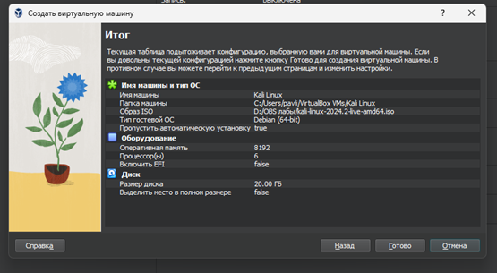
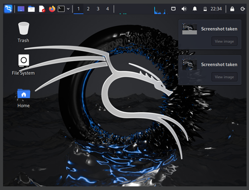

---
# Preamble
 
author:
  name: Павличенко Родион Андреевич
  degrees: DSc
  orcid: 0000-0002-0877-7063
  email: 1132246838@pfur.ru
  affiliation:
    - name: Российский университет дружбы народов
      country: Российская Федерация
      postal-code: 117198
      city: Москва
      address: ул. Миклухо-Маклая, д. 6

institute: |
  Российский университет дружбы народов
date: ""
 
title: Индивидуальный проект этап № 1
subtitle: Установка Kali Linux
license: CC BY
 
lang: ru-RU
crossref:
  lof-title: Список иллюстраций
  lot-title: Список таблиц
  lol-title: Листинги
 
format:
  beamer:
    pdf-engine: xelatex
    mainfont: "DejaVu Serif"
    sansfont: "DejaVu Sans"
    monofont: "DejaVu Sans Mono"
    toc: true
    toc-title: Содержание
    number-sections: true
    colorlinks: false
    toc-depth: 2
    slide_level: 2
    aspectratio: 169
    section-titles: true
    theme: metropolis
    themeoptions: progressbar=frametitle,sectionpage=progressbar,numbering=fraction
    babel-lang: russian
    babel-otherlangs: english
  revealjs:
    transition: slide
    margin: 0.2
    smaller: false
    output-ext: html
    theme: beige
    logo: _resources/image/logo_rudn.png
---
 
# Информация
 
## Докладчик
 
::: {.columns align=center}
::: {.column width="70%"}

::: {.nonincremental} 
- **ФИО:** Павличенко Родион Андреевич
- **Статус:** Cтудент
- **Группа:** НПИбд-02-24
- **ВУЗ:** Российский университет дружбы народов им. П. Лумумбы
- **Почта:**[1132246838@pfur.ru](mailto:1132246838@pfur.ru)
:::
 
:::
::: {.column width="30%"}
:::
:::

# Выполнение лабораторной работы
 
## Создаем новую виртуальную машину
 
{width=100%}

## Создали виртуальную машину и запустили ее
 
{width=100%}

## Произвели настройку ОС
 
{width=100%}

## Создали учетную запись
 
{width=100%}

## Завершили установку и перезагрузили систему
 
{width=100%}

## Запустили систему и проверили, что все работает
 
{width=100%}
 
