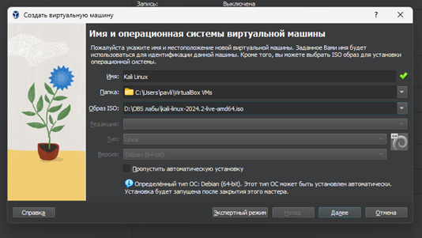
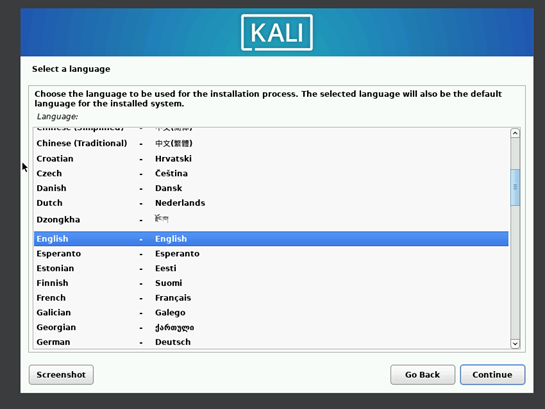
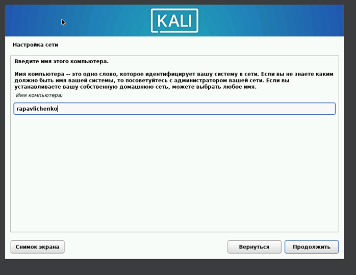
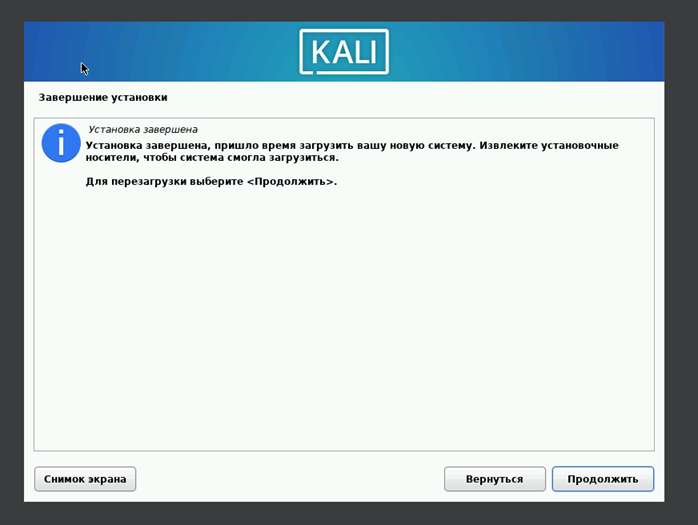

---
## Author
author:
  name: Павличенко Родион Андреевич
  degrees: DSc
  orcid: 0000-0002-0877-7063
  email: 1132246838@pfur.ru
  affiliation:
    - name: Российский университет дружбы народов
      country: Российская Федерация
      postal-code: 117198
      city: Москва
      address: ул. Миклухо-Маклая, д. 6

## Title
title: "Индивидуальный проект этап №1"
subtitle: "Установка Kali Linux"
license: "CC BY"
---

# Цель работы

Установить дистрибутив Kali Linux в виртуальную машину.

# Выполнение лабораторной работы

Создаем новую виртуальную машину

{#fig-001 width=70%}

Создали виртуальную машину и запустили ее

{#fig-001 width=70%}

Произвели настройку ОС

{#fig-001 width=70%}

Создали учетную запись

{#fig-001 width=70%}

Завершили установку и перезагрузили систему

{#fig-001 width=70%}

Запустили систему и проверили, что все работает

{#fig-001 width=70%}

# Выводы

Успешно установили дистрибутив Kali Linux в виртуальную машину.

# Список литературы{.unnumbered}

::: {#refs}
:::
