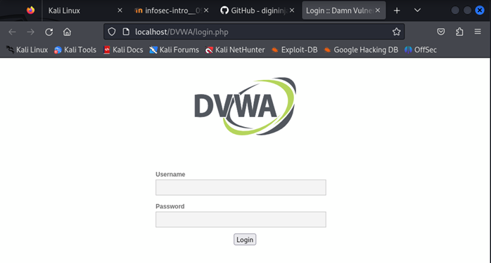
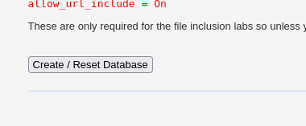
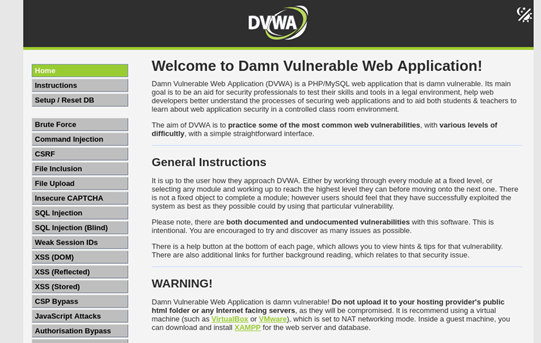

---
## Author
author:
  name: Павличенко Родион Андреевич
  degrees: DSc
  orcid: 0000-0002-0877-7063
  email: 1132246838@pfur.ru
  affiliation:
    - name: Российский университет дружбы народов
      country: Российская Федерация
      postal-code: 117198
      city: Москва
      address: ул. Миклухо-Маклая, д. 6

## Title
title: "Индивиуальный проект №2"
subtitle: "Установка DVWA"
license: "CC BY"
---

# Цель работы

Установить DVWA в гостевую систему к Kali Linux.

# Выполнение лабораторной работы

Заходим на GitHub по ссылке и устанавливаем DVWA через командную строку

{#fig-001 width=70%}

SQL-user , пользователь root и пароль от моего аккаунта

{#fig-001 width=70%}

Попробовали перейти по ссылке, убедились, что все работает

{#fig-001 width=70%}

Нажали Create/Reset Database и заново ввели имя пользователя и пароль

{#fig-001 width=70%}

Успешно зашли, установка завершена

{#fig-001 width=70%}

# Выводы

Установили DVWA в гостевую систему к Kali Linux.

# Список литературы{.unnumbered}

::: {#refs}
:::
