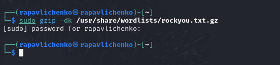
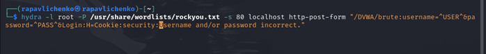
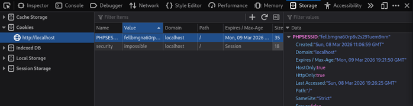
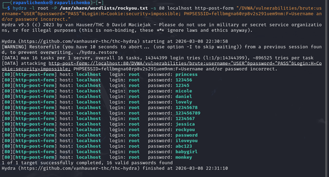

---
## Author
author:
  name: Павличенко Родион Андреевич
  degrees: DSc
  orcid: 0000-0002-0877-7063
  email: 1132246838@pfur.ru
  affiliation:
    - name: Российский университет дружбы народов
      country: Российская Федерация
      postal-code: 117198
      city: Москва
      address: ул. Миклухо-Маклая, д. 6

## Title
title: "Индивидуальный проект этап № 3"
subtitle: "Использование Hydra"
license: "CC BY"
---

# Цель работы

Научиться пользоваться Hydra.

# Выполнение лабораторной работы

Распаковали наши пароли

{#fig-001 width=70%}

Создаем запрос к Hydra

{#fig-001 width=70%}

Заходим в раздел Inspect для просмотра Storage

{#fig-001 width=70%}

Запускаем запрос к Hydra и успешно находим пароли

{#fig-001 width=70%}

# Выводы

Мы научились пользоваться Hydra.

# Список литературы{.unnumbered}

::: {#refs}
:::
