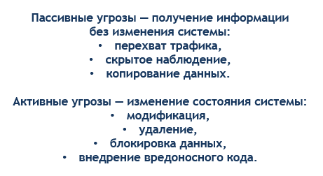
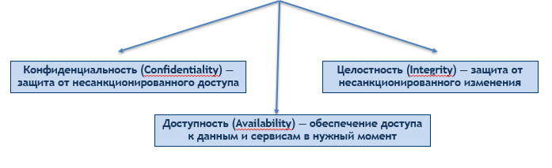
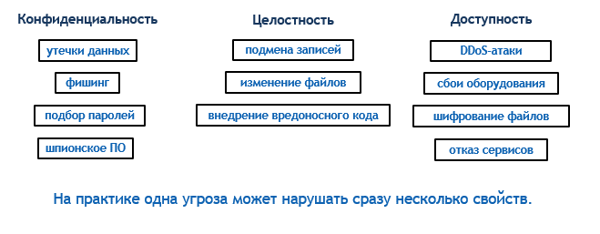

---
# Preamble

author:
  name: Павличенко Родион Андреевич
  degrees: DSc
  orcid: 0000-0002-0877-7063
  email: 1132246838@pfur.ru
  affiliation:
    - name: Российский университет дружбы народов
      country: Российская Федерация
      postal-code: 117198
      city: Москва
      address: ул. Миклухо-Маклая, д. 6

institute: |
  Российский университет дружбы народов
date: ""

title: Доклад по дисциплине «Основы информационной безопасности»
subtitle: Классы угроз информационной безопасности
license: CC BY

lang: ru-RU
crossref:
  lof-title: Список иллюстраций
  lot-title: Список таблиц
  lol-title: Листинги

format:
  beamer:
    pdf-engine: xelatex
    mainfont: "DejaVu Serif"
    sansfont: "DejaVu Sans"
    monofont: "DejaVu Sans Mono"
    toc: true
    toc-title: Содержание
    number-sections: true
    colorlinks: false
    toc-depth: 2
    slide_level: 2
    aspectratio: 169
    section-titles: true
    theme: metropolis
    themeoptions: progressbar=frametitle,sectionpage=progressbar,numbering=fraction
    babel-lang: russian
    babel-otherlangs: english
  revealjs:
    transition: slide
    margin: 0.2
    smaller: false
    output-ext: html
    theme: beige
    logo: _resources/image/logo_rudn.png
---

# Информация

## Докладчик

:::::::::::::: {.columns align=center}
::: {.column width="70%"}

::: {.nonincremental} 
- **ФИО:** Павличенко Родион Андреевич
- **Статус:** Cтудент
- **Группа:** НПИбд-02-24
- **ВУЗ:** Российский университет дружбы народов им. П. Лумумбы
- **Почта:**[1132246838@pfur.ru](mailto:1132246838@pfur.ru)
:::

:::
::: {.column width="30%"}

<!-- Можно добавить фото или логотип -->
<!-- {width=85%} -->

:::
::::::::::::::

## Актуальность темы

::: {.nonincremental} 
- Информационные системы постоянно подвергаются внешним и внутренним воздействиям.
- Для построения защиты важно понимать, **какие именно угрозы** существуют.
- Классификация угроз помогает перейти от общих рассуждений к конкретным мерам защиты.
:::

# Теоретическая часть

## Цель

Изучить классы угроз информационной безопасности, определить их основные признаки, источники и способы реализации, а также показать значение классификации угроз для построения эффективной системы защиты информации.

## Задачи

::: {.nonincremental} 
1) Определить понятие угрозы информационной безопасности.

2) Рассмотреть основные подходы к классификации угроз.

3) Проанализировать классы угроз по источнику и способу реализации.

4) Изучить угрозы с точки зрения конфиденциальности, целостности и доступности.

5) Показать практическое значение классификации угроз для построения защиты.
:::

## Ключевые понятия (для понимания темы)

::: {.nonincremental} 
- **Угроза** — потенциальная причина инцидента, способная нанести ущерб информации или системе.
- **Уязвимость** — слабое место, через которое угроза может быть реализована.
- **Риск** — вероятность реализации угрозы с учетом возможного ущерба.
:::

## Понятие угрозы информационной безопасности

[Угроза информационной безопасности — это совокупность условий и факторов, создающих опасность нарушения защищенности информации или нормального функционирования информационной системы.](image/ph1.png){width=100%}

## Почему нужна классификация угроз

{width=100%}

## Угрозы по источнику возникновения

{width=100%}

## Угрозы по характеру возникновения

{width=100%}

## Угрозы по характеру воздействия

{width=100%}

## Модель CIA: основные свойства информации

{width=100%}

## Примеры угроз в модели CIA

{width=100%}

## Практическое значение классификации угроз

::: {.nonincremental} 
- Помогает формировать **модель угроз** для конкретной системы.
- Позволяет правильно расставлять приоритеты в защите.
- Упрощает выбор мер защиты под конкретные классы угроз.
- Повышает качество анализа рисков и реагирования на инциденты.
:::

## Да что там Windows! Самая неотлаженная и глючная система — это жизнь. © Стас Янковский

{width=100%}
