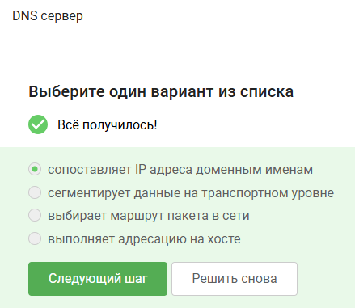
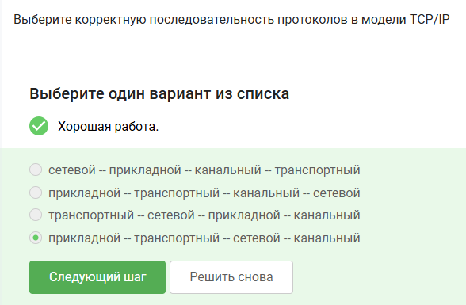
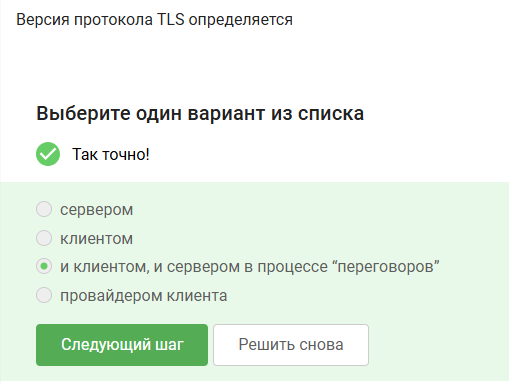
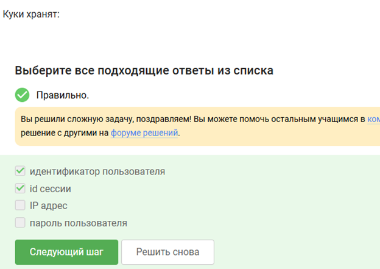
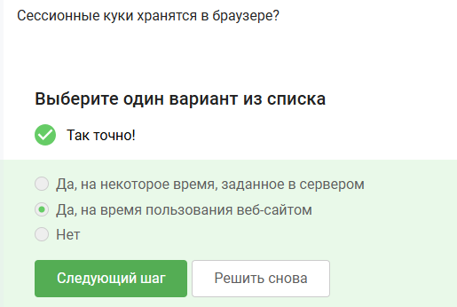
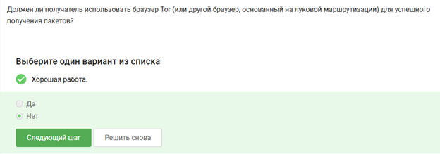
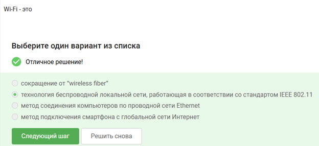

---
# Preamble
 
author:
  name: Павличенко Родион Андреевич
  email: 1132246838@pfur.ru
  affiliation:
    - name: Российский университет дружбы народов
      country: Российская Федерация
      postal-code: 117198
      city: Москва
      address: ул. Миклухо-Маклая, д. 6
 
institute: |
  Российский университет дружбы народов
date: ""
 
title: "Внешний курс Stepik"
subtitle: "Первый этап"
license: CC BY
 
lang: ru-RU
 
format:
  beamer:
    pdf-engine: xelatex
    mainfont: "DejaVu Serif"
    sansfont: "DejaVu Sans"
    monofont: "DejaVu Sans Mono"
    toc: true
    toc-title: Содержание
    number-sections: true
    colorlinks: false
    toc-depth: 2
    slide_level: 2
    aspectratio: 169
    section-titles: true
    theme: metropolis
    themeoptions: progressbar=frametitle,sectionpage=progressbar,numbering=fraction
    babel-lang: russian
    babel-otherlangs: english
---
 
# Информация
 
## Докладчик
 
::: {.columns align=center}
::: {.column width="70%"}
 
- **ФИО:** Павличенко Родион Андреевич
- **Статус:** студент
- **Группа:** НПИбд-02-24
- **ВУЗ:** Российский университет дружбы народов им. П. Лумумбы
- **Почта:** [1132246838@pfur.ru](mailto:1132246838@pfur.ru)
 
:::
::: {.column width="30%"}
:::
:::
 
# Цель работы
 
## Цель первого этапа
 
Цель работы — пройти первый этап внешнего курса на платформе Stepik и изучить базовые принципы работы компьютерных сетей, сетевых протоколов и технологий защиты данных.
 
# Выполнение лабораторной работы
 
## Вопрос 1
 
{width=90%}
 
HTTPS относится к прикладному уровню, так как используется браузером и сервером для обмена веб-данными.
 
## Вопрос 2
 
{width=90%}
 
TCP работает на транспортном уровне и обеспечивает надёжную передачу пакетов между устройствами.
 
## Вопрос 3
 
{width=90%}
 
Корректный IPv4-адрес должен состоять из четырёх чисел в диапазоне от 0 до 255.
 
## Вопрос 4
 
{width=90%}
 
DNS используется для преобразования доменных имён сайтов в IP-адреса.
 
## Вопрос 5
 
{width=90%}
 
В модели TCP/IP данные проходят через прикладной, транспортный, сетевой и канальный уровни.
 
## Вопрос 6
 
{width=90%}
 
HTTP не использует шифрование, поэтому данные передаются в открытом виде.
 
## Вопрос 7
 
{width=90%}
 
HTTPS сначала выполняет TLS-рукопожатие, после чего начинается защищённая передача данных.
 
## Вопрос 8
 
{width=90%}
 
Версия TLS определяется в процессе согласования между клиентом и сервером.
 
## Вопрос 9
 
{width=90%}
 
Во время TLS-рукопожатия стороны согласуют параметры защиты и формируют ключи шифрования.
 
## Вопрос 10
 
{width=90%}
 
Cookies позволяют сохранять идентификатор пользователя и информацию о сессии.
 
## Вопрос 11
 
{width=90%}
 
Cookies используются для хранения данных пользователя, но не влияют на надёжность сетевого соединения.
 
## Вопрос 12
 
{width=90%}
 
Cookies обычно создаются сервером и сохраняются браузером пользователя.
 
## Вопрос 13
 
{width=90%}
 
Сессионные cookies удаляются после завершения сессии или закрытия браузера.
 
## Вопрос 14
 
{width=90%}
 
TOR использует несколько промежуточных узлов для сокрытия маршрута передачи данных.
 
## Вопрос 15
 
{width=90%}
 
В сети TOR конечный IP-адрес известен отправителю и выходному узлу.
 
## Вопрос 16
 
{width=90%}
 
В TOR используется многоуровневое шифрование с отдельными ключами для каждого узла маршрута.
 
## Вопрос 17
 
{width=90%}
 
Получателю необязательно использовать TOR Browser, так как выходной узел может обращаться к обычным сайтам.
 
## Вопрос 18
 
{width=90%}
 
WiFi — технология беспроводной передачи данных внутри локальной сети.
 
## Вопрос 19
 
{width=90%}
 
WiFi работает на канальном уровне и отвечает за передачу кадров между устройствами.
 
## Вопрос 20
 
{width=90%}
 
WEP считается устаревшим методом защиты WiFi из-за большого количества уязвимостей.
 
# Итоги
 
## Результаты выполнения
 
В ходе выполнения первого этапа курса были изучены:
 
- модель TCP/IP;
- протоколы HTTP, HTTPS и TLS;
- IP-адресация и DNS;
- cookies и сессионные данные;
- принципы работы TOR;
- основы WiFi и защиты беспроводных сетей.
 
# Выводы
 
## Вывод
 
В ходе выполнения работы был успешно пройден первый этап внешнего курса на платформе Stepik. Были закреплены знания о сетевых протоколах, принципах передачи данных и базовых технологиях защиты информации в сети.
