 
# Цель работы
 
Цель работы — пройти первый этап внешнего курса на платформе Stepik.
 
# Выполнение лабораторной работы
 
В ходе выполнения работы был успешно пройден первый этап внешнего курса на платформе Stepik. Ниже представлены выполненные задания и краткие пояснения к выбранным ответам.
 
## Вопрос 1. Выберите протокол прикладного уровня
 
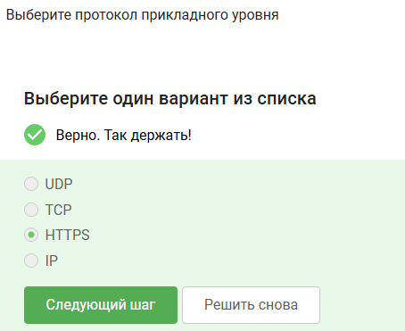{#fig-001 width=70%}
 
Я выбрал HTTPS, потому что этот протокол используется сайтами для передачи данных между браузером и сервером. Он относится к прикладному уровню.
 
## Вопрос 2. На каком уровне работает протокол TCP?
 
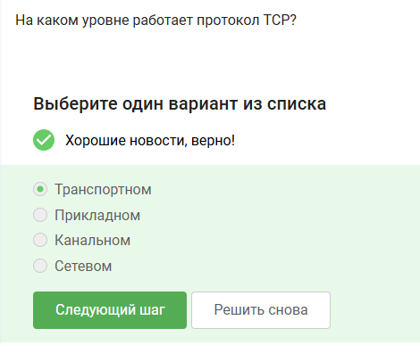{#fig-002 width=70%}
 
Я выбрал транспортный уровень, потому что TCP отвечает за передачу данных между устройствами и следит за их доставкой.
 
## Вопрос 3. Выберите все корректные адреса IPv4
 
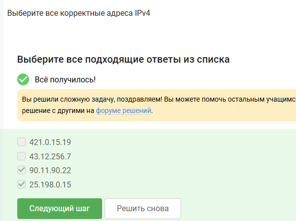{#fig-003 width=70%}
 
Я выбрал корректные IPv4-адреса, потому что каждый блок адреса должен быть числом от 0 до 255.
 
## Вопрос 4. DNS сервер
 
{#fig-004 width=70%}
 
Я выбрал вариант про сопоставление доменных имён и IP-адресов, потому что DNS нужен для поиска сайта по его имени.
 
## Вопрос 5. Выберите корректную последовательность протоколов в модели TCP/IP
 
{#fig-005 width=70%}
 
Я выбрал эту последовательность, потому что данные проходят уровни TCP/IP сверху вниз: от приложения к передаче по сети.
 
## Вопрос 6. Протокол HTTP предполагает
 
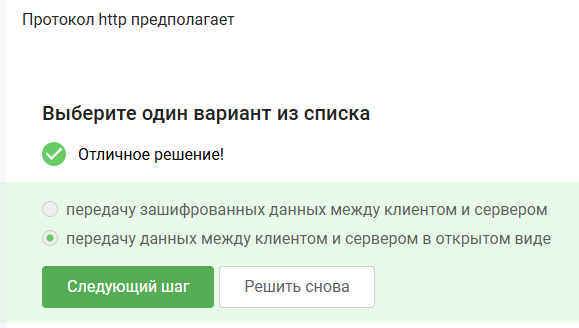{#fig-006 width=70%}
 
Я выбрал передачу данных в открытом виде, потому что HTTP не шифрует информацию между клиентом и сервером.
 
## Вопрос 7. Протокол HTTPS состоит из
 
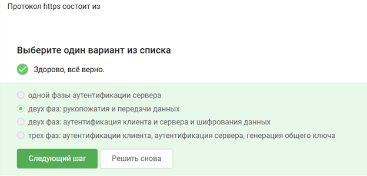{#fig-007 width=70%}
 
Я выбрал вариант с рукопожатием и передачей данных, потому что сначала устанавливается защищённое соединение, а потом передаются данные.
 
## Вопрос 8. Версия протокола TLS определяется
 
{#fig-008 width=70%}
 
Я выбрал вариант про клиента и сервер, потому что версия TLS согласуется между двумя сторонами при подключении.
 
## Вопрос 9. В фазе «рукопожатия» протокола TLS не предусмотрено
 
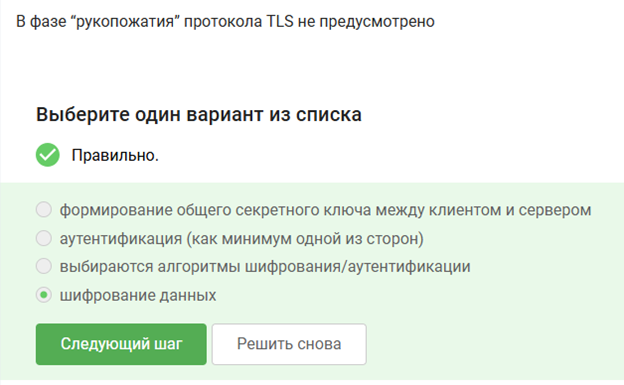{#fig-009 width=70%}
 
Я выбрал шифрование данных, потому что на этапе рукопожатия стороны только договариваются о параметрах защиты.
 
## Вопрос 10. Куки хранят
 
{#fig-010 width=70%}
 
Я выбрал идентификатор пользователя и сессии, потому что cookies позволяют сайту помнить пользователя и его состояние входа.
 
## Вопрос 11. Куки не используются для
 
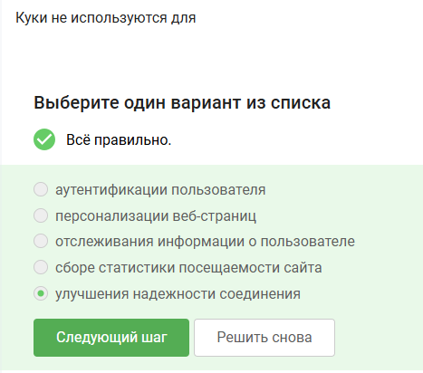{#fig-011 width=70%}
 
Я выбрал надёжность соединения, потому что cookies относятся к работе сайта, а не к качеству сетевого соединения.
 
## Вопрос 12. IP-адрес получателя известен
 
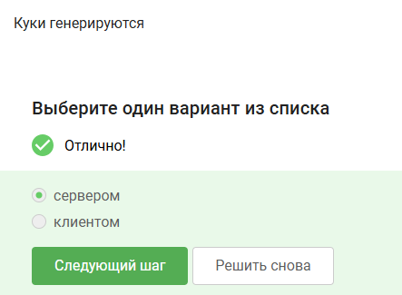{#fig-012 width=70%}
 
Я выбрал отправителя и выходной узел, потому что отправитель задаёт конечный адрес, а выходной узел отправляет запрос к получателю.
 
## Вопрос 13. Отправитель генерирует общий секретный ключ
 
{#fig-013 width=70%}
 
Я выбрал вариант со всеми узлами, потому что в TOR данные шифруются послойно для каждого узла маршрута.
 
## Вопрос 14. Должен ли получатель использовать браузер TOR?
 
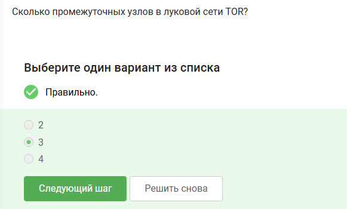{#fig-014 width=70%}
 
Я выбрал «нет», потому что через TOR можно обращаться и к обычным сайтам, которые не используют TOR Browser.
 
## Вопрос 15. WiFi — это
 
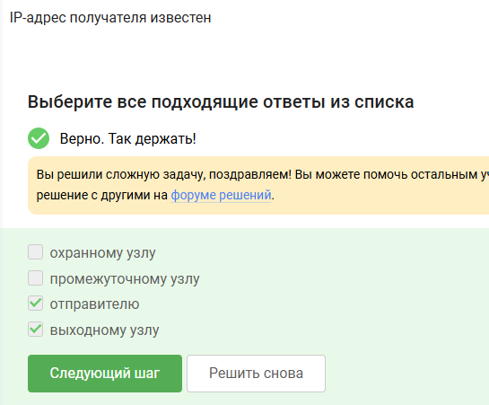{#fig-015 width=70%}
 
Я выбрал технологию беспроводной сети, потому что WiFi позволяет подключаться к сети без проводов.
 
## Вопрос 16. На каком уровне работает протокол WiFi?
 
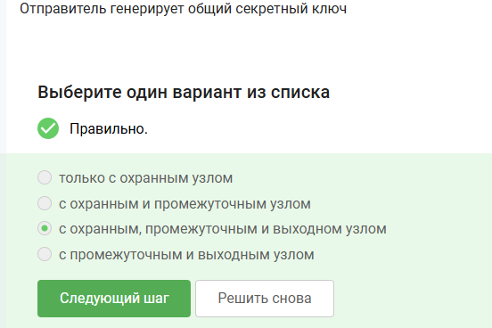{#fig-016 width=70%}
 
Я выбрал канальный уровень, потому что WiFi отвечает за передачу кадров между устройством и точкой доступа.
 
## Вопрос 17. Небезопасный метод обеспечения шифрования и аутентификации в сети WiFi
 
{#fig-017 width=70%}
 
Я выбрал WEP, потому что это старый способ защиты WiFi, который сейчас считается небезопасным.
 
## Вопрос 18. Данные между хостом сети и роутером
 
{#fig-018 width=70%}
 
Я выбрал вариант с шифрованием, потому что в защищённой WiFi-сети данные между устройством и роутером передаются не в открытом виде.
 
## Вопрос 19. Для домашней сети для аутентификации обычно используется метод
 
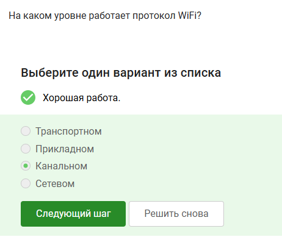{#fig-019 width=70%}
 
Я выбрал WPA2 Personal, потому что в домашних сетях обычно используется общий пароль от WiFi.
 
## Вопрос 20. Куки генерируются
 
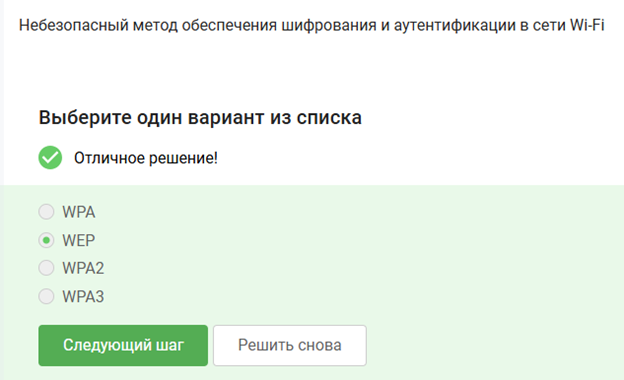{#fig-020 width=70%}
 
Я выбрал сервер, потому что сервер создаёт cookies и передаёт их браузеру пользователя.
 
# Выводы
 
В ходе выполнения работы был успешно пройден первый этап внешнего курса на платформе Stepik. Были закреплены базовые знания о компьютерных сетях, протоколах передачи данных, HTTPS, TLS, DNS, cookies, WiFi и сети TOR.
 
# Список литературы{.unnumbered}
 
1. Stepik — образовательная платформа.
2. Материалы внешнего курса по компьютерным сетям.
