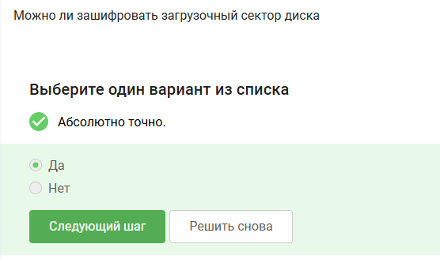
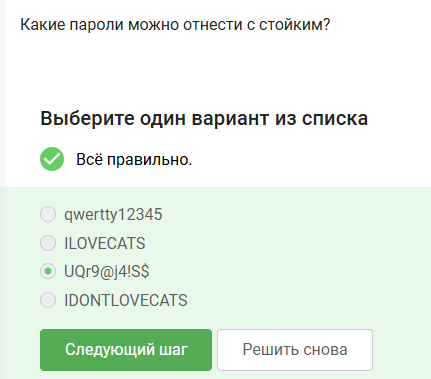
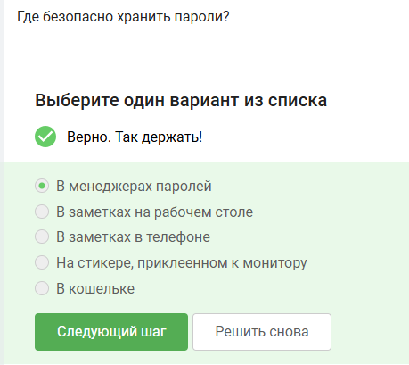
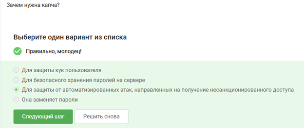
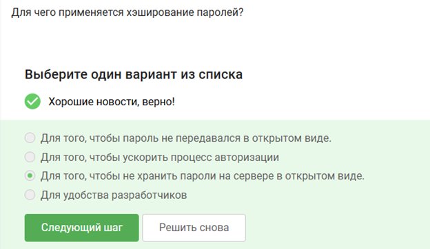
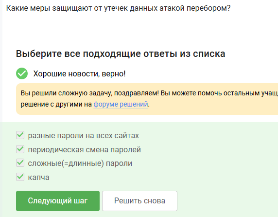
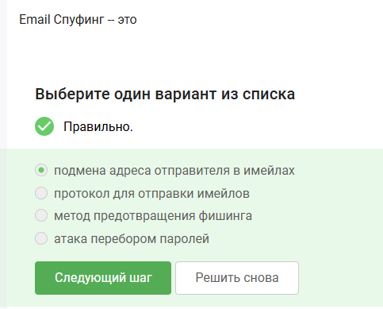
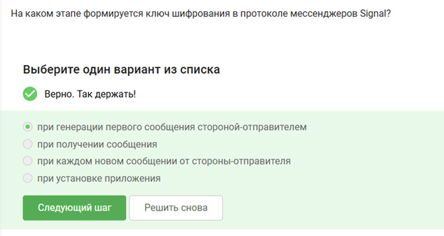

---
# Preamble
 
author:
  name: Павличенко Родион Андреевич
  email: 1132246838@pfur.ru
  affiliation:
    - name: Российский университет дружбы народов
      country: Российская Федерация
      postal-code: 117198
      city: Москва
      address: ул. Миклухо-Маклая, д. 6
 
institute: |
  Российский университет дружбы народов
date: ""
 
title: "Внешний курс Stepik"
subtitle: "Второй этап"
license: CC BY
 
lang: ru-RU
 
format:
  beamer:
    pdf-engine: xelatex
    mainfont: "DejaVu Serif"
    sansfont: "DejaVu Sans"
    monofont: "DejaVu Sans Mono"
    toc: true
    toc-title: Содержание
    number-sections: true
    colorlinks: false
    toc-depth: 2
    slide_level: 2
    aspectratio: 169
    section-titles: true
    theme: metropolis
    themeoptions: progressbar=frametitle,sectionpage=progressbar,numbering=fraction
    babel-lang: russian
    babel-otherlangs: english
---
 
# Информация
 
## Докладчик
 
::: {.columns align=center}
::: {.column width="70%"}
 
- **ФИО:** Павличенко Родион Андреевич
- **Статус:** студент
- **Группа:** НПИбд-02-24
- **ВУЗ:** Российский университет дружбы народов им. П. Лумумбы
- **Почта:** [1132246838@pfur.ru](mailto:1132246838@pfur.ru)
 
:::
::: {.column width="30%"}
:::
:::
 
# Цель работы
 
## Цель второго этапа
 
Цель работы — пройти второй этап внешнего курса на платформе Stepik и изучить методы защиты информации, безопасного хранения данных и современные механизмы аутентификации.
 
# Выполнение лабораторной работы
 
## Вопрос 1
 
{width=90%}
 
Полное шифрование диска позволяет защитить данные даже при физическом доступе к устройству.
 
## Вопрос 2
 
{width=90%}
 
Для шифрования дисков чаще используется симметричное шифрование, так как оно обеспечивает высокую скорость обработки данных.
 
## Вопрос 3
 
{width=90%}
 
VeraCrypt и BitLocker предназначены для шифрования дисков и защиты информации на устройстве.
 
## Вопрос 4
 
{width=90%}
 
Стойкий пароль должен содержать буквы разного регистра, цифры и специальные символы.
 
## Вопрос 5
 
{width=90%}
 
Менеджеры паролей позволяют безопасно хранить и генерировать сложные уникальные пароли.
 
## Вопрос 6
 
{width=90%}
 
CAPTCHA используется для защиты от автоматических запросов и ботов.
 
## Вопрос 7
 
{width=90%}
 
Хэширование позволяет хранить пароль не в открытом виде, а в форме необратимого преобразования.
 
## Вопрос 8
 
{width=90%}
 
Соль используется для защиты от заранее подготовленных таблиц хэшей и одинаковых хэшей у разных пользователей.
 
## Вопрос 9
 
{width=90%}
 
Сложные пароли и ограничение попыток входа помогают защититься от атак перебором.
 
## Вопрос 10
 
{width=90%}
 
Фишинговые ссылки часто маскируются под настоящие сайты для кражи логинов и паролей.
 
## Вопрос 11
 
{width=90%}
 
Фишинговые письма могут отправляться даже от поддельных или взломанных адресов знакомых пользователей.
 
## Вопрос 12
 
{width=90%}
 
Email Spoofing — подмена адреса отправителя для имитации доверенного источника.
 
## Вопрос 13
 
{width=90%}
 
Троян маскируется под легитимную программу и после запуска может выполнять вредоносные действия.
 
## Вопрос 14
 
{width=90%}
 
В Signal ключи шифрования формируются при установке защищённого соединения между пользователями.
 
## Вопрос 15
 
{width=90%}
 
Сквозное шифрование обеспечивает доступ к содержимому сообщений только отправителю и получателю.
 
# Итоги
 
## Результаты выполнения
 
В ходе второго этапа курса были изучены:
 
- шифрование дисков;
- методы хранения паролей;
- CAPTCHA и хэширование;
- защита от перебора;
- фишинг и Email Spoofing;
- вредоносное программное обеспечение;
- сквозное шифрование.
 
# Выводы
 
## Вывод
 
В ходе выполнения работы был успешно пройден второй этап внешнего курса на платформе Stepik. Были закреплены знания о методах защиты данных, безопасной аутентификации и современных механизмах информационной безопасности.
