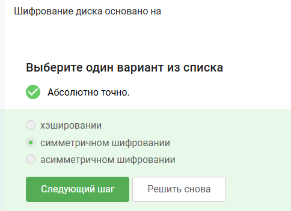
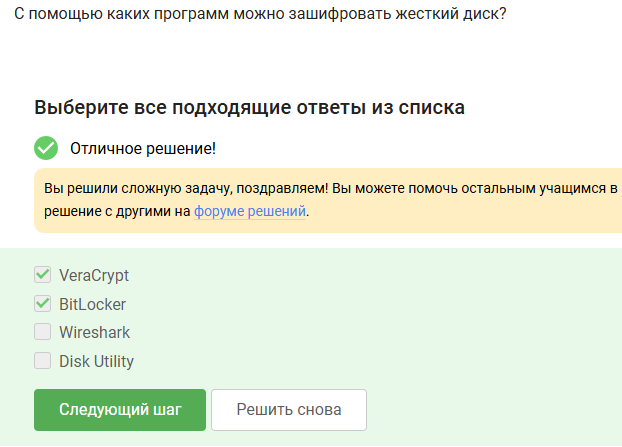
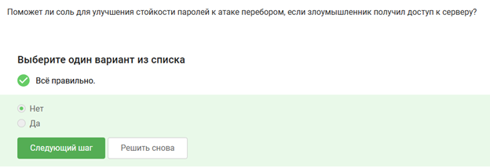
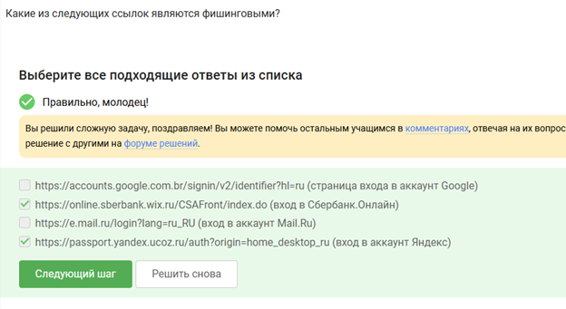
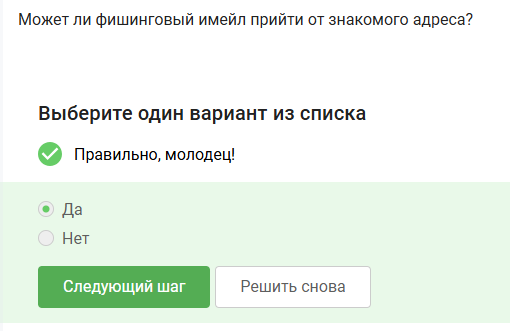
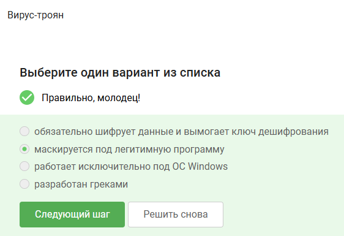
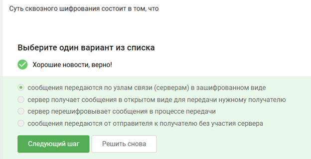

 
# Цель работы
 
Цель работы — пройти второй этап внешнего курса на платформе Stepik.
 
# Выполнение лабораторной работы
 
В ходе выполнения работы был успешно пройден второй этап внешнего курса на платформе Stepik. Ниже представлены выполненные задания, изображения с ответами и краткие пояснения к ним.
 
## Вопрос 1. Можно ли зашифровать загрузочный сектор диска?
 
{#fig-001 width=70%}
 
Я выбрал ответ «Да», потому что загрузочный сектор диска тоже может быть защищён при полном шифровании диска. Это используется для защиты данных ещё до запуска операционной системы.
 
## Вопрос 2. Шифрование диска основано на
 
{#fig-002 width=70%}
 
Я выбрал симметричное шифрование, потому что для шифрования и расшифрования данных на диске обычно используется один и тот же секретный ключ. Это быстрее и удобнее для работы с большими объёмами данных.
 
## Вопрос 3. С помощью каких программ можно зашифровать жёсткий диск?
 
{#fig-003 width=70%}
 
Я выбрал VeraCrypt и BitLocker, потому что эти программы предназначены для шифрования дисков и разделов. Wireshark используется для анализа сетевого трафика, а Disk Utility не является основным средством шифрования в данном контексте курса.
 
## Вопрос 4. Какие пароли можно отнести к стойким?
 
{#fig-004 width=70%}
 
Я выбрал сложный пароль с разными символами, потому что стойкий пароль должен быть длинным и содержать буквы разного регистра, цифры и специальные символы. Простые слова и короткие комбинации легко подобрать.
 
## Вопрос 5. Где безопасно хранить пароли?
 
{#fig-005 width=70%}
 
Я выбрал менеджер паролей, потому что он хранит пароли в зашифрованном виде и позволяет не запоминать каждый пароль вручную. Хранить пароли на стикере, в телефоне или на мониторе небезопасно.
 
## Вопрос 6. Зачем нужна капча?
 
{#fig-006 width=70%}
 
Я выбрал вариант про защиту от автоматизированных атак, потому что капча помогает отличить человека от программы. Это снижает риск массового подбора паролей и автоматической отправки запросов.
 
## Вопрос 7. Для чего применяется хэширование паролей?
 
{#fig-007 width=70%}
 
Я выбрал вариант про хранение паролей на сервере в скрытом виде. Хэширование нужно для того, чтобы сервер не хранил настоящий пароль пользователя открытым текстом.
 
## Вопрос 8. Поможет ли соль улучшить стойкость паролей к атаке перебором?
 
{#fig-008 width=70%}
 
Я выбрал «Нет», потому что соль в первую очередь защищает от готовых таблиц хэшей и одинаковых хэшей у разных пользователей. Сама по себе соль не делает слабый пароль устойчивым к прямому перебору.
 
## Вопрос 9. Какие меры защищают от утечек данных атакой перебором?
 
{#fig-009 width=70%}
 
Я выбрал разные пароли на всех сайтах, периодическую смену паролей, сложные длинные пароли и капчу. Эти меры усложняют подбор пароля и уменьшают ущерб, если один пароль всё-таки стал известен.
 
## Вопрос 10. Какие из следующих ссылок являются фишинговыми?
 
{#fig-010 width=70%}
 
Я выбрал ссылки, которые внешне похожи на адреса известных сервисов, но имеют подозрительный домен или лишние части в адресе. Фишинговые ссылки часто маскируются под настоящие сайты, чтобы украсть логин и пароль.
 
## Вопрос 11. Может ли фишинговый имейл прийти от знакомого адреса?
 
{#fig-011 width=70%}
 
Я выбрал «Да», потому что адрес отправителя можно подделать или получить доступ к почте знакомого человека. Поэтому важно проверять не только адрес, но и содержание письма, ссылки и вложения.
 
## Вопрос 12. Email Spoofing — это
 
{#fig-012 width=70%}
 
Я выбрал подмену адреса отправителя в письмах. Email Spoofing используется для того, чтобы письмо выглядело как отправленное от доверенного человека или организации.
 
## Вопрос 13. Вирус-троян
 
{#fig-013 width=70%}
 
Я выбрал вариант, что троян маскируется под легитимную программу. Такой вредоносный код выглядит как обычное приложение, но после запуска может выполнять опасные действия.
 
## Вопрос 14. На каком этапе формируется ключ шифрования в протоколе мессенджера Signal?
 
{#fig-014 width=70%}
 
Я выбрал вариант при генерации первого сообщения стороной-отправителем. В Signal защищённое соединение устанавливается заранее, чтобы первое сообщение уже могло быть отправлено в зашифрованном виде.
 
## Вопрос 15. Суть сквозного шифрования состоит в том, что
 
{#fig-015 width=70%}
 
Я выбрал вариант, что сообщения передаются через серверы в зашифрованном виде. При сквозном шифровании прочитать сообщение могут только отправитель и получатель, а сервер не имеет доступа к содержимому.
 
# Выводы
 
В ходе выполнения работы был успешно пройден второй этап внешнего курса на платформе Stepik. Были закреплены знания о шифровании дисков, безопасном хранении паролей, защите от перебора, фишинге, подмене email-адресов, вредоносных программах и сквозном шифровании.
 
# Список литературы{.unnumbered}
 
1. Stepik — образовательная платформа.
2. Материалы внешнего курса по информационной безопасности.
