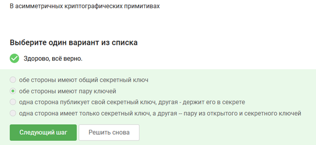
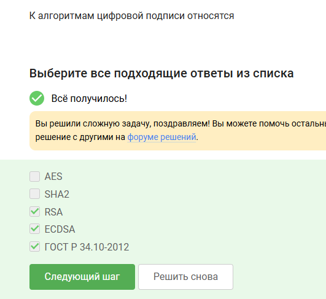
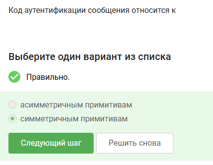
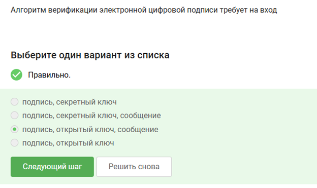
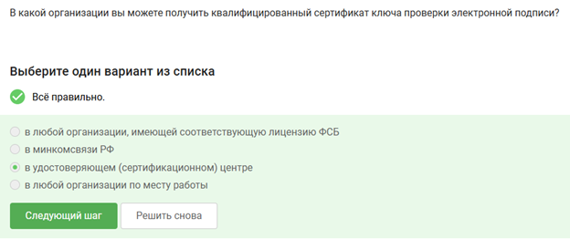
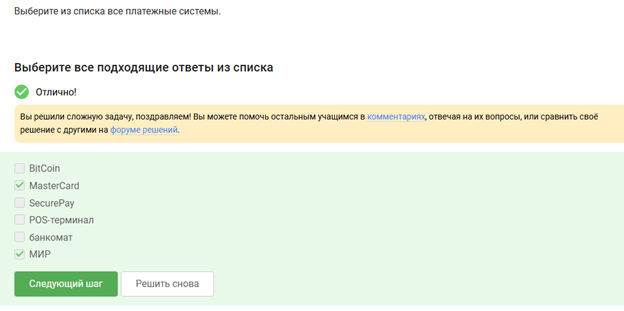
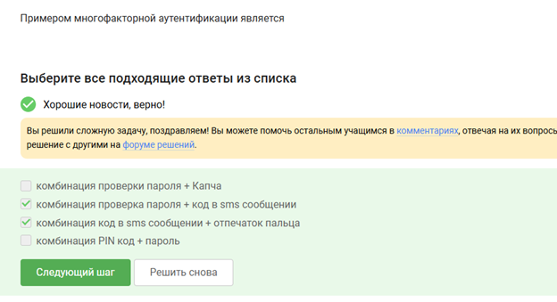

---
# Preamble
 
author:
  name: Павличенко Родион Андреевич
  email: 1132246838@pfur.ru
  affiliation:
    - name: Российский университет дружбы народов
      country: Российская Федерация
      postal-code: 117198
      city: Москва
      address: ул. Миклухо-Маклая, д. 6
 
institute: |
  Российский университет дружбы народов
date: ""
 
title: "Внешний курс Stepik"
subtitle: "Третий этап"
license: CC BY
 
lang: ru-RU
 
format:
  beamer:
    pdf-engine: xelatex
    mainfont: "DejaVu Serif"
    sansfont: "DejaVu Sans"
    monofont: "DejaVu Sans Mono"
    toc: true
    toc-title: Содержание
    number-sections: true
    colorlinks: false
    toc-depth: 2
    slide_level: 2
    aspectratio: 169
    section-titles: true
    theme: metropolis
    themeoptions: progressbar=frametitle,sectionpage=progressbar,numbering=fraction
    babel-lang: russian
    babel-otherlangs: english
---
 
# Информация
 
## Докладчик
 
::: {.columns align=center}
::: {.column width="70%"}
 
- **ФИО:** Павличенко Родион Андреевич
- **Статус:** студент
- **Группа:** НПИбд-02-24
- **ВУЗ:** Российский университет дружбы народов им. П. Лумумбы
- **Почта:** [1132246838@pfur.ru](mailto:1132246838@pfur.ru)
 
:::
::: {.column width="30%"}
:::
:::
 
# Цель работы
 
## Цель третьего этапа
 
Цель работы — пройти третий этап внешнего курса на платформе Stepik и изучить методы криптографической защиты информации и современные механизмы информационной безопасности.
 
# Выполнение лабораторной работы
 
## Вопрос 1
 
{width=90%}
 
Асимметричное шифрование использует пару ключей: открытый и закрытый. Это позволяет безопасно передавать данные без передачи секретного ключа.
 
## Вопрос 2
 
{width=90%}
 
Симметричное шифрование обеспечивает высокую скорость обработки данных и применяется для работы с большими объёмами информации.
 
## Вопрос 3
 
{width=90%}
 
Цифровой сертификат подтверждает подлинность сервера и используется для защиты соединения от подмены.
 
## Вопрос 4
 
{width=90%}
 
TLS обеспечивает шифрование передаваемых данных и защищает соединение между клиентом и сервером.
 
## Вопрос 5
 
{width=90%}
 
Электронная подпись используется для подтверждения подлинности отправителя и целостности данных.
 
## Вопрос 6
 
{width=90%}
 
Хэширование применяется для безопасного хранения паролей и проверки неизменности данных.
 
## Вопрос 7
 
{width=90%}
 
Использование сложных паролей снижает вероятность успешного перебора и компрометации аккаунта.
 
## Вопрос 8
 
{width=90%}
 
Двухфакторная аутентификация добавляет дополнительный уровень защиты помимо обычного пароля.
 
## Вопрос 9
 
{width=90%}
 
Фишинговые сайты имитируют реальные сервисы для получения логинов, паролей и других данных пользователя.
 
## Вопрос 10
 
{width=90%}
 
Вредоносное программное обеспечение может использоваться для кражи данных и получения доступа к системе.
 
## Вопрос 11
 
{width=90%}
 
Резервное копирование помогает предотвратить потерю данных при сбоях системы или кибератаках.
 
## Вопрос 12
 
{width=90%}
 
Обновления безопасности устраняют известные уязвимости и повышают защищённость системы.
 
## Вопрос 13
 
{width=90%}
 
Межсетевой экран фильтрует сетевой трафик и ограничивает несанкционированный доступ к устройству.
 
## Вопрос 14
 
{width=90%}
 
Сквозное шифрование обеспечивает доступ к содержимому сообщений только участникам переписки.
 
## Вопрос 15
 
{width=90%}
 
Использование защищённых протоколов уменьшает риск перехвата и изменения данных при передаче.
 
## Вопрос 16
 
{width=90%}
 
Комплексное применение методов информационной безопасности повышает уровень защиты системы и пользовательских данных.
 
# Итоги
 
## Результаты выполнения
 
В ходе третьего этапа курса были изучены:
 
- асимметричное и симметричное шифрование;
- цифровые сертификаты и TLS;
- электронная подпись и хэширование;
- двухфакторная аутентификация;
- фишинг и вредоносное ПО;
- резервное копирование и межсетевые экраны;
- сквозное шифрование.
 
# Выводы
 
## Вывод
 
В ходе выполнения работы был успешно пройден третий этап внешнего курса на платформе Stepik. Были закреплены знания о криптографической защите информации и современных механизмах обеспечения информационной безопасности.
