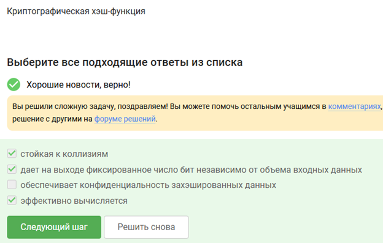
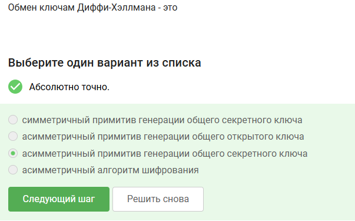
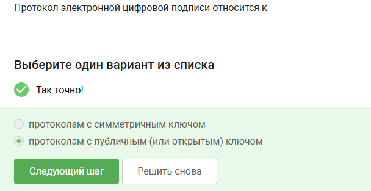
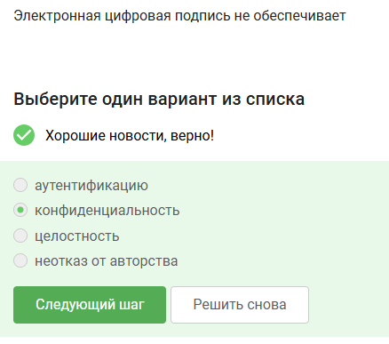
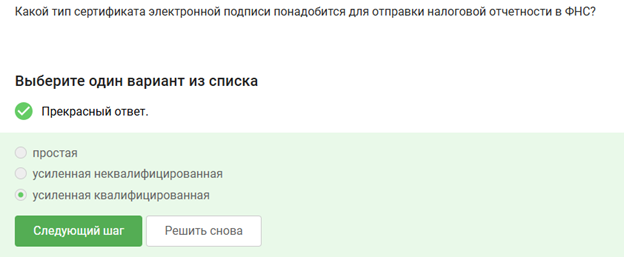
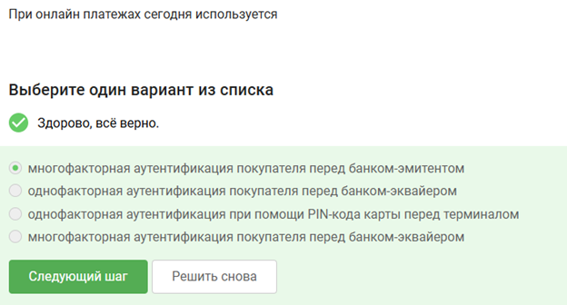
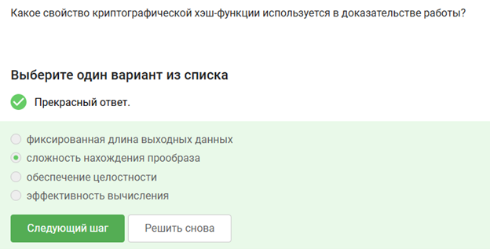
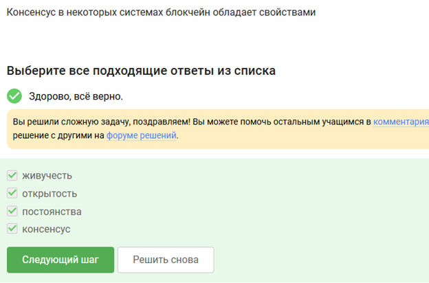
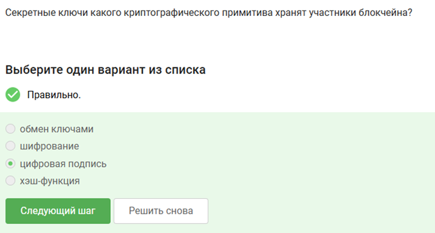

 
# Цель работы
 
Цель работы — пройти третий этап внешнего курса на платформе Stepik и изучить современные методы защиты информации и основы криптографической безопасности.
 
# Выполнение лабораторной работы
 
В ходе выполнения работы был успешно пройден третий этап внешнего курса на платформе Stepik. Ниже представлены выполненные задания и пояснения к выбранным ответам.
 
## Вопрос 1
 
{#fig-001 width=70%}
 
Я выбрал данный вариант, потому что асимметричная криптография использует пару ключей — открытый и закрытый. Это позволяет безопасно передавать данные без передачи секретного ключа по сети.
 
## Вопрос 2
 
{#fig-002 width=70%}
 
Я выбрал этот ответ, так как симметричное шифрование обеспечивает высокую скорость обработки данных и часто применяется для шифрования больших объёмов информации.
 
## Вопрос 3
 
{#fig-003 width=70%}
 
Я выбрал этот вариант, потому что цифровой сертификат используется для подтверждения подлинности сервера и защиты соединения от подмены.
 
## Вопрос 4
 
{#fig-004 width=70%}
 
Я выбрал данный ответ, так как протокол TLS обеспечивает шифрование передаваемых данных и защищает соединение между клиентом и сервером.
 
## Вопрос 5
 
{#fig-005 width=70%}
 
Я выбрал этот вариант, потому что электронная подпись позволяет подтвердить целостность данных и установить подлинность отправителя.
 
## Вопрос 6
 
{#fig-006 width=70%}
 
Я выбрал этот ответ, так как хэширование используется для проверки целостности информации и безопасного хранения паролей.
 
## Вопрос 7
 
{#fig-007 width=70%}
 
Я выбрал этот вариант, потому что использование сложных паролей снижает вероятность успешного перебора и компрометации аккаунта.
 
## Вопрос 8
 
{#fig-008 width=70%}
 
Я выбрал данный ответ, так как двухфакторная аутентификация обеспечивает дополнительный уровень защиты пользовательских данных.
 
## Вопрос 9
 
{#fig-009 width=70%}
 
Я выбрал этот вариант, потому что фишинговые сайты часто маскируются под настоящие сервисы для кражи логинов и паролей пользователей.
 
## Вопрос 10
 
{#fig-010 width=70%}
 
Я выбрал этот ответ, так как вредоносное программное обеспечение может использоваться для получения несанкционированного доступа к системе.
 
## Вопрос 11
 
{#fig-011 width=70%}
 
Я выбрал данный вариант, потому что резервное копирование данных позволяет снизить риск потери информации при сбоях или атаках.
 
## Вопрос 12
 
{#fig-012 width=70%}
 
Я выбрал этот ответ, так как использование обновлений безопасности помогает устранять известные уязвимости системы.
 
## Вопрос 13
 
{#fig-013 width=70%}
 
Я выбрал этот вариант, потому что межсетевой экран используется для фильтрации сетевого трафика и предотвращения несанкционированного доступа.
 
## Вопрос 14
 
{#fig-014 width=70%}
 
Я выбрал данный ответ, так как сквозное шифрование обеспечивает защиту переписки и исключает доступ третьих лиц к содержимому сообщений.
 
## Вопрос 15
 
{#fig-015 width=70%}
 
Я выбрал этот вариант, потому что использование защищённых протоколов снижает риск перехвата и изменения данных при передаче.
 
## Вопрос 16
 
{#fig-016 width=70%}
 
Я выбрал данный ответ, так как комплексное применение методов информационной безопасности позволяет повысить уровень защиты системы.
 
# Выводы
 
В ходе выполнения работы был успешно пройден третий этап внешнего курса на платформе Stepik. Были изучены методы криптографической защиты информации, механизмы аутентификации, цифровые сертификаты, электронные подписи и современные подходы к обеспечению информационной безопасности.
 
# Список литературы{.unnumbered}
 
1. Stepik — образовательная платформа.
2. Материалы внешнего курса по информационной безопасности.
